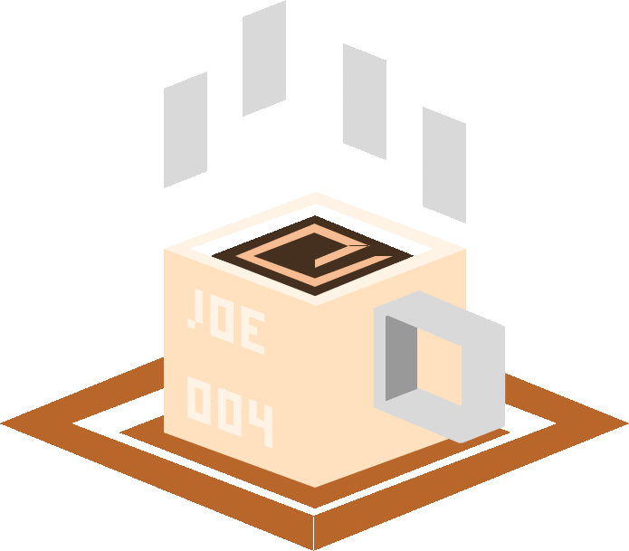

  

# Hey, I'm Joe. Welcome To My Profile!

<!-- A little about you -->
I'm an electrical engineering student passionate about signal processing, power systems management, and language learning. I enjoy building apps to make day-to-day life easier, and fun projects on the side.

---

## What I'm working on

- [VisualScannerApp](https://github.com/mou-ikkaiGLT/VisualScannerApp) — Scan any popular language to transcribe and translate
- [my-renderer](https://github.com/mou-ikkaiGLT/my-renderer) — OpenGL based shape renderer
- [ArduinoAngleMeasurement](https://github.com/mou-ikkaiGLT/ArduinoAngleMeasurement) - Work with my-renderer project to mimic physical arduino angle with rendered shape angle

## Currently learning

- Developing MacOS apps with SWIFT
- OpenGL rendering with C
- Becoming fluent in japanese ;)

## Languages and Tools

**Languages:**

**Tools:**

## Get in touch

- Linkedin: https://www.linkedin.com/in/joegraham04/

---

<!-- Optional: GitHub stats. Replace 'mou-ikkaiGLT' with your actual GitHub username -->
<!--

-->
